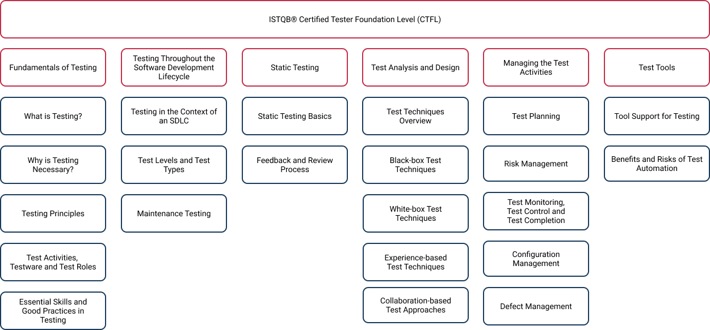
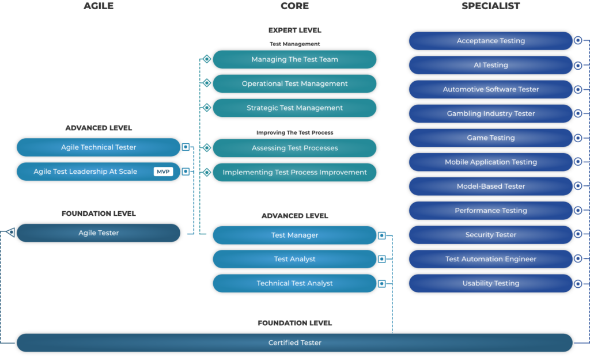
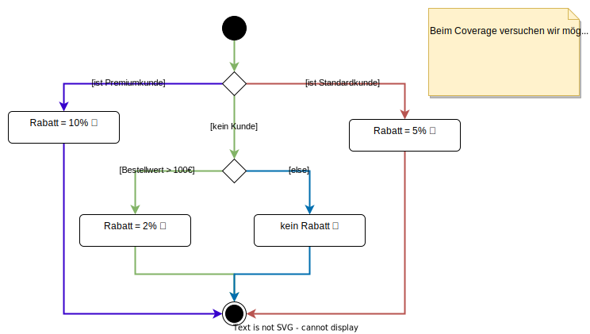

# Allgemeines

- Aktueller Lehrplan ist Version 4.0.1. Dieser wurde im Jahr 2023 veröffentlicht.
- Ab Juni 2024 können Prüfungen nur noch nach dem neuen Lehrplan abgelegt werden.
- Bis einschließlich Mai 2024 sind noch Prüfungen mit Lehrplan 3.1 möglich.
- ca. 70% des Lehrplans sind zwischen v.3.1 und v4.0 identisch geblieben.
- Die Prüfung dauert 60 Minuten, wobei 40 Multiple-Choice-Fragen  zu beantworten sind. 
  - Um die Prüfung zu bestehen, müssen 65% der Gesamtpunktzahl erreicht werden, also 26 Punkte.
  - Für jede Frage gibt es genau einen Punkt.
  - Bei manchen Fragen braucht man deutlich mehr Zeit, um sie zu beantworten, als bei anderen. Trotzdem ist die Punktzahl stets 1.
- **Hinweis:** Wenn man die Prüfung in einer Sprache abhält, die nicht die eigene Muttersprache ist, kann man eine Verlängerung der Prüfungszeit um 25% beantragen. Das sind bei 60 Minuten Prüfungszeit 15 Minuten zusätzlich.

# Lehrplan

- Der Lehrplan ist in 6 Kapitel unterteilt.
- Die Kapitel 4 und 5 sind am wichtigsten, da sich ca. 50% der Prüfungsfragen auf diese beiden Kapitel beziehen.

# Weiterbildungsmöglichkeiten

Die Foundation Level Zertifizierung ist die Basis für alle weiteren Zertifizierung des ISTQB. Es gibt folgende Ausbildungsstufen:

- Foundation Level
- Advanced Level
- Expert Level

Zusätzlich sind Module für Spezialisierungen wie Game Testing und Usability Testing möglich. Außerdem sind auch im Bereich Agile Softwaretesting separate Zertifizierungen durchführbar.

# Unterschied zwischen Efficiency and Effectiveness

- Efficiency: Ein gutes Verhältnis zwischen Nutzen eines Tests und die dafür benötigten Ressourcen wie Zeit, Personal, Budget etc.
- Effectiveness: Damit meint man die Wirksamkeit eines Tests. Ein Test ist wirksam, wenn er genau testet, was gewünscht ist und akkurate sowie vollständige Ergebnisse liefert.

# Chapter 1

## What is Testing

- Eine Software zu testen bedeutet nicht nur, die Software auszuführen und auf Fehler zur prüfen, sondern auch die Dokumentation zu bewerten, den Quelltext zu lesen und nach logischen Fehlern zu suchen.
- Unterschied Verifizierung und Validierung:
  - Beim Verifizieren wird geprüft, ob die Software ihre Spezifikation bzw. die Anforderungsliste korrekt umsetzt.
  - Bei der Validierung wird geprüft, ob die Software das tut, was ihre Endanwender von ihr erwarten.
  - Mit anderen Worten: Wenn eine Software laut Spezifikation korrekt implementiert wurde (Verifikation), aber nicht das tut, was der Kunde sich gewünscht hat (Validierung), dann hat die Software keinen wirklichen Nutzen und somit ihr Ziel verfehlt.
- dynamisches Testen: Die Software befindet sich in der Ausführung, während getestet wird.
- statisches Testen: Die Software wird ohne Ausführung getestet, z.B. durch gemeinsame Reviews des Source Codes. Es wird vor allem nach logischen Programmierfehlern im Quelltext gesucht. Beispiel: Im Quelltext wird eine Division ausgeführt, aber der Quelltext prüft nicht, ob der Teiler Null ist (Fault, Defect). Wenn nun versucht wird, durch Null zu teilen, stürzt das Programm ab (Failure/Ausfall/Fehlfunktion).

### Ziele von Software-Testing

- Bewertung von Arbeitsergebnissen, wie Anforderungsdokumente, User Stories, Entwürfe (UI und Softwarearchitektur), Quelltext etc.
- Beispiel User Story: As a manager (Rolle), I want to be able to understand my colleagues progress (Was soll das System leisten?), so I can better report our sucess and failures (Intent, Begründung für Anforderung).
- Mängel (Defects) in der Software finden: z.B. logischer Programmierfehler im Quelltext (`ArrayIndexOutOfBounds`, `DivisionByZero`, Endlosschleifen etc.).
- Fehlverhalten (Failures) in der Software auslösen: z.B. Eingabe eines Wortes statt einer Zahl führt zum Absturz eines Programms (`Exception`) oder zu einem falschen Ergebnis (z.B. `NaN` in JavaScript).
- Möglichst alle Pfade durch das Programm testen (Test Coverage), sofern technisch durchführbar.

Beispiel für ein Test Coverage eines Algorithmus zur Berechnung von Kundenrabatten:

